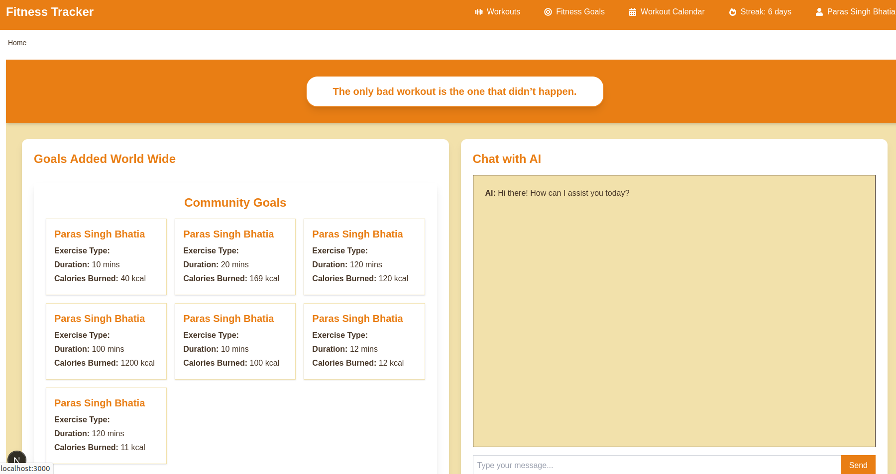
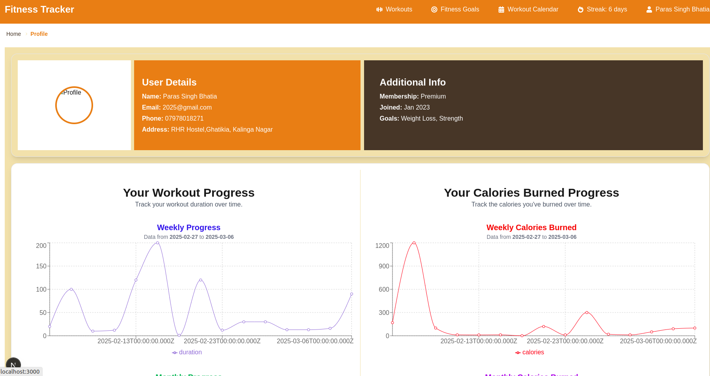
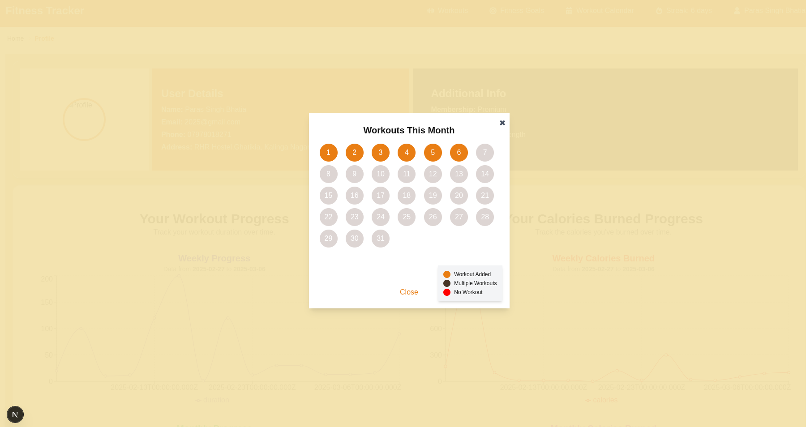

# Fitness Tracker Application

Welcome to the Fitness Tracker Application! This application helps you track your workouts, set fitness goals, and visualize your progress using graphs.

## Table of Contents

- [Getting Started](#getting-started)
- [About the Application](#about-the-application)
- [Features](#features)
- [Screenshots](#screenshots)

## Getting Started

Follow these steps to get the application up and running on your local machine:

1. **Clone the Repository**

   ```bash
   git clone https://github.com/your-username/fitness-tracker.git
   cd fitness-tracker

   ```

2. npm install

3. npm run dev

## About The Application

The Fitness Tracker Application is designed to help users track their fitness journey. With this application, you can:

- **Add and manage your workouts**: Easily add, edit, and delete workouts. Track details such as duration, calories burned, and more.
- **Set and track fitness goals**: Define your fitness goals and monitor your progress towards achieving them.
- **View your progress**: Use intuitive graphs and charts to visualize your workout data and track your improvements over time.
- **Stay motivated**: Visualize your achievements to keep yourself motivated and on track.See workout calender and streaks

## Features

- **Workout Management**: Easily add, edit, and delete workouts. Track details such as duration, calories burned, and more.
- **Goal Setting**: Set fitness goals and track your progress towards achieving them.
- **Visualizations**: Use graphs and charts to visualize your workout data and track your improvements.
- **User-Friendly Interface**: Intuitive and easy-to-use interface for a seamless user experience.

## Screenshots

### Screenshot 1: Landing Page


_Landing page featuring a navbar and an AI chat interface for user interaction._

### Screenshot 2: Profile Page


_Profile page displaying user details and charts to track fitness progress._

### Screenshot 3: Workout Calendar


_Workout calendar view for scheduling and tracking workouts._
